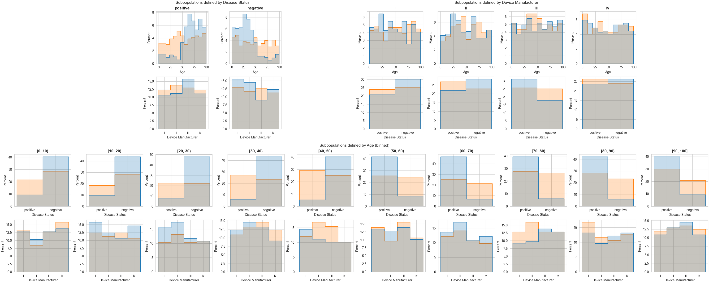

Example
=======

.. note:: Want more details or just prefer to run the code yourself? 
    This example is also available in our `test notebook <https://github.com/DIDSR/DART/blob/main/test.ipynb>`_.

Suppose you have a dataset ("Population A") that you want to compare to a reference population ("Population B"). 
Assessments of the distributional similarity would typically be done by looking at the histograms of the different :abbr:`attributes (distinct pieces of metadata information)`:

.. figure:: _static/images/attribute_distributions.png
    :alt: Histograms showing the attribute distributions of the three attributes Device Manufacturer, Disese Status, and Age. The two Populations A and B are shown in different colors. The distributions of all three attributes are similar between Population A and B.

If you looked at those histogram distributions, you'd probably say that the two populations have similar distributions. But those histograms don't show the full picture.

DART distributional similarity analysis of the two distributions suggests that the distributional similarity of some of the subpopulations isn't quite as high as the similarity of the entire populations.

.. list-table:: DART Distribution Similarity Measurements
    :header-rows: 1
    :widths: 20 20 20

    * - :abbr:`Subgroup Attributes (Attributes used to define the subpopulation)`
      - Similarity From
      - Similarity (mean)
    * - Disease Status
      - Age
      - **0.950**
    * - Device Manufacturer
      - Disease Status
      - 0.983
    * - Disease Status
      - Device Manufacturer
      - 0.983
    * - Device Manufacturer
      - Age
      - 0.998
    * - :abbr:`N/A (similarity measured between entire populations)`
      - Disease Status
      - 0.999
    * - :abbr:`N/A (similarity measured between entire populations)`
      - Age
      - 0.999
    * - :abbr:`N/A (similarity measured between entire populations)`
      - Device Manufacturer
      - 1.000

In particular, the similarity of the the Age distributions between the subpopulations defined by Disease Status (first row of the table) seem quite low.

.. figure:: _static/images/skewed_distribution.png
    :width: 66%
    :alt: Two histograms showing the distribution of patient ages for Disease Status negative (left) and Disease Status positive (right). The distributions of populations A and B are overlayed in different colors. While the age distribution of population B is relatively uniform for both disease statuses, the age distributions of population A are not, with the majority of the disease status positive patients being older than 50 and the majority of the disease status negative patients younger than 50.

This skew is quite apparent from the subpopulation histogram, but without the DART distribution similarity measurement, we wouldn't have known to look at the histogram at all. 
Afterall, for this simple dataset, there are a minimum sixteen subpopulations to look at (assuming ages are binned by decade):

... And that's assuming that you're only looking at subpopulations defined by a single attribute.
